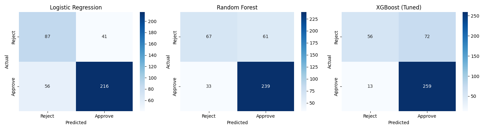
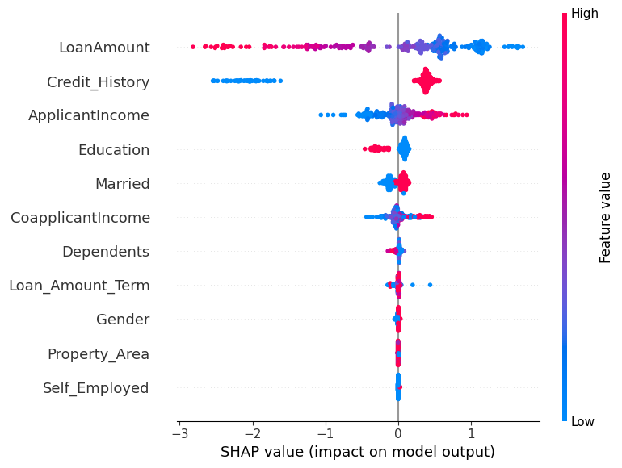
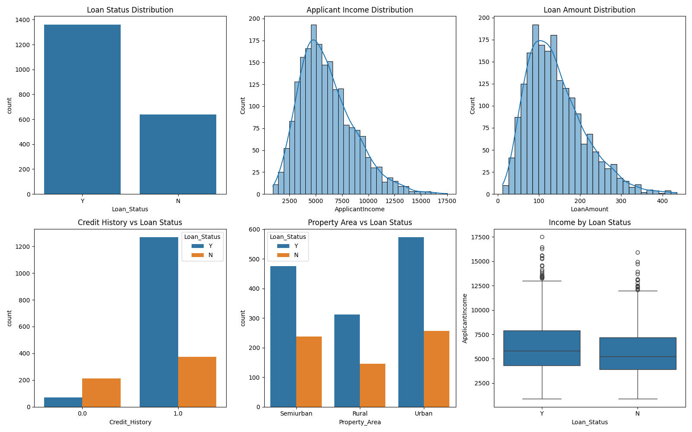

<<<<<<< HEAD
# Loan Approval Prediction — End-to-End ML Pipeline

An end-to-end machine learning project that predicts loan approval likelihood based on applicant details, with model explainability (SHAP) and a deployed interactive web app (Streamlit).

## Problem Statement

Financial institutions need to assess loan applications quickly and fairly. This project builds a classification model to predict whether a loan application will be **approved or rejected** based on applicant demographics, income, credit history, and loan details — and explains *why* each prediction was made.

## Dataset

2,000 synthetic loan applications modeled on the classic "Loan Prediction" dataset structure, including realistic missing values and class imbalance (~32% rejection rate). Features include:
- Demographics: Gender, Marital Status, Dependents, Education, Self-Employment status
- Financials: Applicant Income, Co-applicant Income, Loan Amount, Loan Term
- Credit History, Property Area

## Screenshots
## Confusion Matrices

## SHAP Summary

## EDA Plots


## Approach

1. **EDA**: Analyzed distributions, missing values, and relationships between features and loan status (see `eda_plots.png`, `correlation_heatmap.png`)
2. **Preprocessing Pipeline**: Median/mode imputation for missing values, standard scaling for numeric features, ordinal encoding for categoricals (all via `sklearn.Pipeline`/`ColumnTransformer`)
3. **Model Training & Comparison**: Trained and evaluated 3 models —
   - Logistic Regression (baseline, with class balancing)
   - Random Forest
   - XGBoost (hyperparameter-tuned via GridSearchCV)
4. **Evaluation**: Accuracy, Precision, Recall, F1, ROC-AUC, Confusion Matrices
5. **Explainability**: SHAP values to interpret feature contributions to individual predictions
6. **Deployment**: Interactive Streamlit app for real-time predictions with SHAP-based explanations

## Results

| Model | Accuracy | Precision | Recall | F1 | ROC-AUC |
|---|---|---|---|---|---|
| Logistic Regression (Baseline) | 0.7575 | 0.8405 | 0.7941 | 0.8166 | 0.8029 |
| Random Forest | 0.7650 | 0.7967 | 0.8787 | 0.8357 | 0.7766 |
| **XGBoost (Tuned)** | **0.7875** | 0.7825 | **0.9522** | **0.8590** | **0.8105** |

**Best model: XGBoost (Tuned)** — selected for highest F1 score and ROC-AUC, with hyperparameters tuned via GridSearchCV (`learning_rate=0.05, max_depth=3, n_estimators=100, scale_pos_weight=2`).

## Project Structure

```
loan_default_project/
├── generate_data.py        # Synthetic dataset generation
├── loan_data.csv            # Dataset
├── 01_eda.py                 # Exploratory data analysis
├── 02_train_model.py         # Preprocessing, training, evaluation
├── 03_shap_explain.py        # SHAP-based model explainability
├── app.py                    # Streamlit deployment app
├── best_model.pkl            # Saved best model (XGBoost pipeline)
├── eda_plots.png
├── correlation_heatmap.png
├── confusion_matrices.png
├── shap_summary.png
├── model_comparison.csv
└── README.md
```

## How to Run

```bash
pip install pandas numpy scikit-learn matplotlib seaborn shap streamlit xgboost

# Generate data and run pipeline
python generate_data.py
python 01_eda.py
python 02_train_model.py
python 03_shap_explain.py

# Launch the app
streamlit run app.py
```

## Tech Stack

Python, Pandas, NumPy, Scikit-learn, XGBoost, SHAP, Matplotlib, Seaborn, Streamlit

## Key Takeaways

- Credit History and Income are the strongest predictors of loan approval (confirmed via SHAP)
- XGBoost outperformed baseline models on F1 and ROC-AUC after hyperparameter tuning
- `scale_pos_weight` tuning effectively handled class imbalance
- Built a full ML lifecycle: data → preprocessing → modeling → evaluation → explainability → deployment
=======
# loan-approval-predictor
End-to-end ML pipeline for loan approval prediction — performed EDA, feature engineering, and trained/compared Logistic Regression, Random Forest, and XGBoost models (best: 78.75% accuracy, 0.81 ROC-AUC). Added SHAP-based explainability and deployed an interactive Streamlit app for real-time predictions.
>>>>>>> 35a12e560eef41baf5bc6824e4f368dd951f5b22
